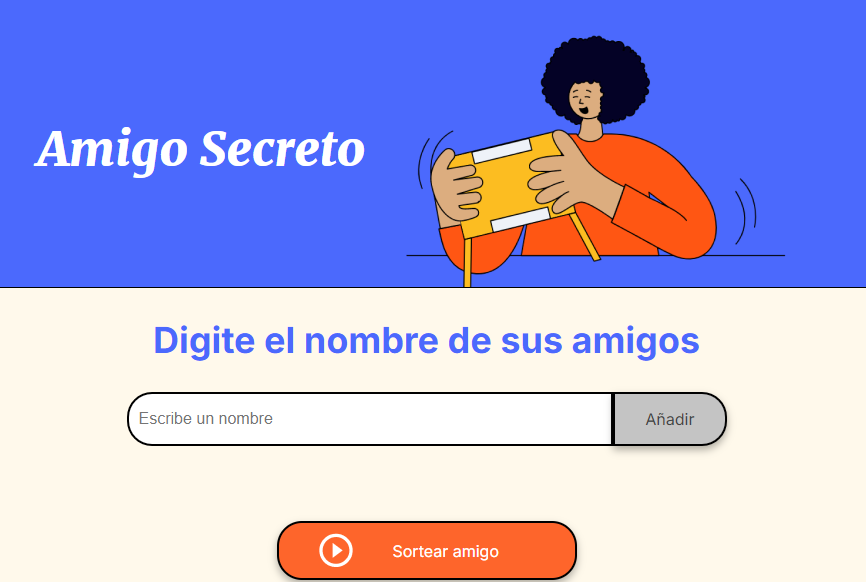
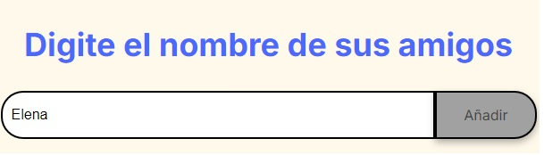
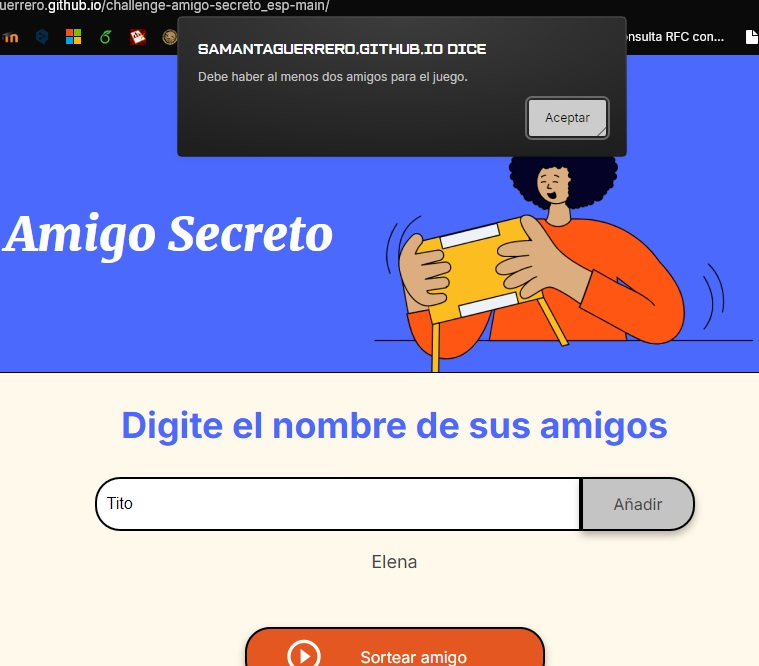
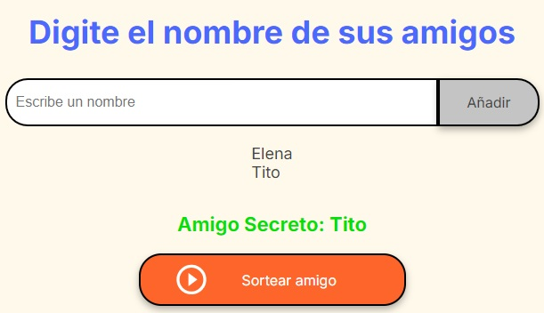

# Juego de Amigo Secreto

## Descripción
Este es el juego del "Amigo Secreto" que permite a los usuarios agregar amigos a una lista y luego realizar un sorteo para elegir un amigo secreto de forma aleatoria.

### ¿Cómo funciona?

1. **Agregar Amigos**: En la página principal del juego hay un campo de entrada para escribir el nombre del amigo (si el campo de entrada está vacío, se mostrará un mensaje de alerta).

   

3. **Sorteo de Amigo Secreto**: Una vez que haya al menos dos amigos en la lista, se puede realizar el sorteo para elegir a un amigo secreto aleatorio (si no hay suficientes amigos, se muestra un mensaje de alerta).

    

5. **Mostrar Resultado**: Al realizar el sorteo, el amigo elegido se muestra en la página.
 
   

## Ejecución
   1. Abre el archivo HTML que contiene este repositorio en tu navegador.
   2. Escribe un nombre en el campo de entrada y haz clic en el botón de "Añadir" para agregarlo a la lista.
   3. Repite este paso para agregar más amigos.
   4. Haz clic en el botón de "Sortear Amigo" para elegir un amigo secreto aleatoriamente.

ó visita esta URL: https://samantaguerrero.github.io/challenge-amigo-secreto_esp-main/ y repite los pasos a partir del número 2.
